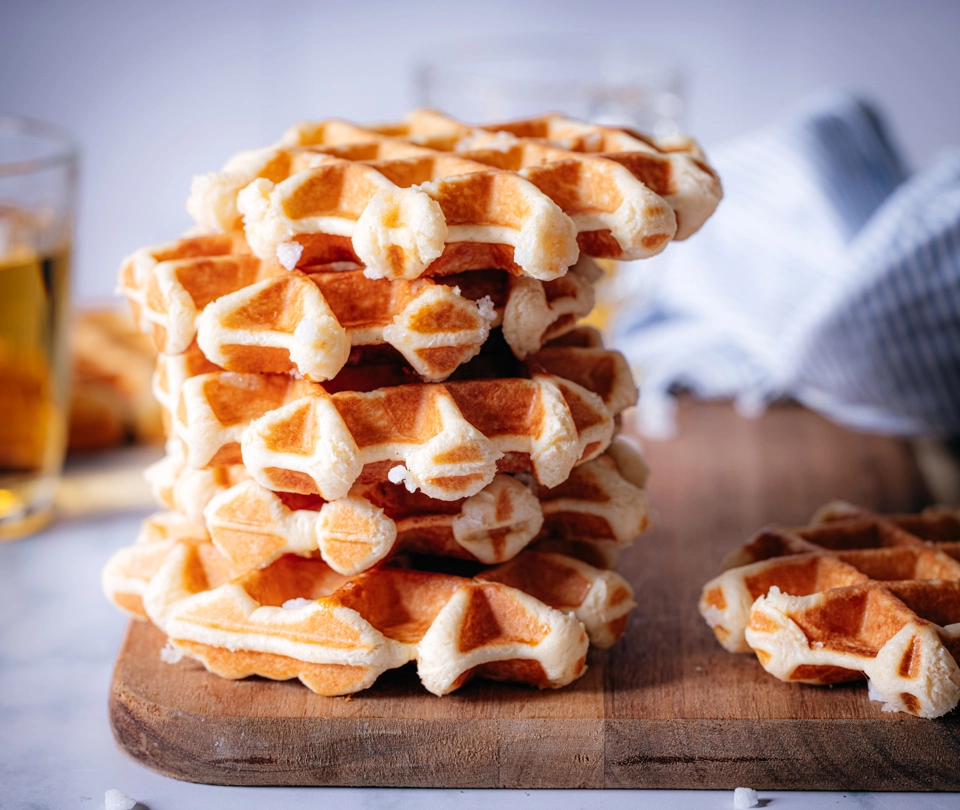

# Belgian Sugar Waffles

Recipe courtesy of [Valerie Bentivenga](https://github.com/ValerieBenti):

> *This is my grandmother's recipe and I have fond memories of eating these waffles. I will spare you the details, however, and get straight to the recipe!*

## Ingredients (for a lot of waffles)

To convert to cups, use a converter like [this one](https://www.thecalculatorsite.com/cooking/cooking-calculator.php).

- 1/2 kg self-rising flour[^1] (sifted)
- 250 g vegetable butter (melted)
- 2 packs of vanilla sugar or a couple of drops of vanilla
- 5 eggs (separated)
- 300 g sugar

[^1]: To make your own self-rising flower: for every 1 cup of all-purpose flour, add 1 1/2 teaspoons baking powder and 1/4 teaspoon fine salt.

## Making the batter

1. Beat the egg whites until stiff and put to the side.
2. In a second bowl, mix the butter  with the sugar, vanilla(sugar) and egg yolks with a wooden spoon.
3. Slowly mix in the sifted flour with the wooden spoon.
4. Finally, carefully fold in the egg whites.

Place the batter in the fridge for at least 3 hours for the best result.

## Baking the waffles

Be sure to pre-heat the waffle iron and grease the iron before baking your first batch. 

Bake for ± 1 min to 1 1/2 min.

## Eating the waffles

This is the best part! You can eat them as is sort of like a cookie, or add fancy toppings like strawberries and cream. Enjoy!

## Footnotes

Here is some more text just for class.
